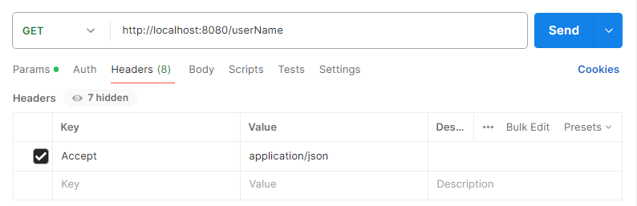

## GitRepoGetter
A simple REST application that allows you to directly download a list of repositories for a given user, along with their branches and the last commit in each of them.

### Backend supported via Postman.

* Localhost: 8080
* Endpoint: <i>/{userName}</i>
* Header: <i>Accept, application/json</i>

### Application details:
* Returns a list of all the user's public repositories with a list of branches attached to each of them, received via the GitHub API.
* When specifying a non-existent user or no user, returns Http status 404 with the information "User not found".
* If an invalid username is entered, returns Http status 400 with the information "Invalid username".
* The application includes unit tests of services, controllers and mapper.

### Technologies used:
* Java 21
* Spring Boot 3.3.1
* Maven, Lombok, JUnit, Mockito

25.07.2024
